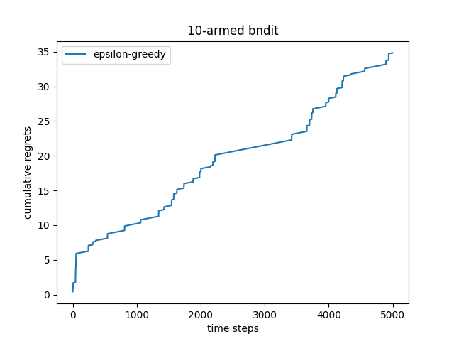

# Display different algotithm result
Aimed at learning the MAB problem is for understanding the exploration and exploitation.
- **exploration**: uniformally draw samples 
- **exploitation**: always choose the arm with the max expected rewards

## Steady epsilon-greedy algorithm

## Decreasing epsilon-greedy algorithm